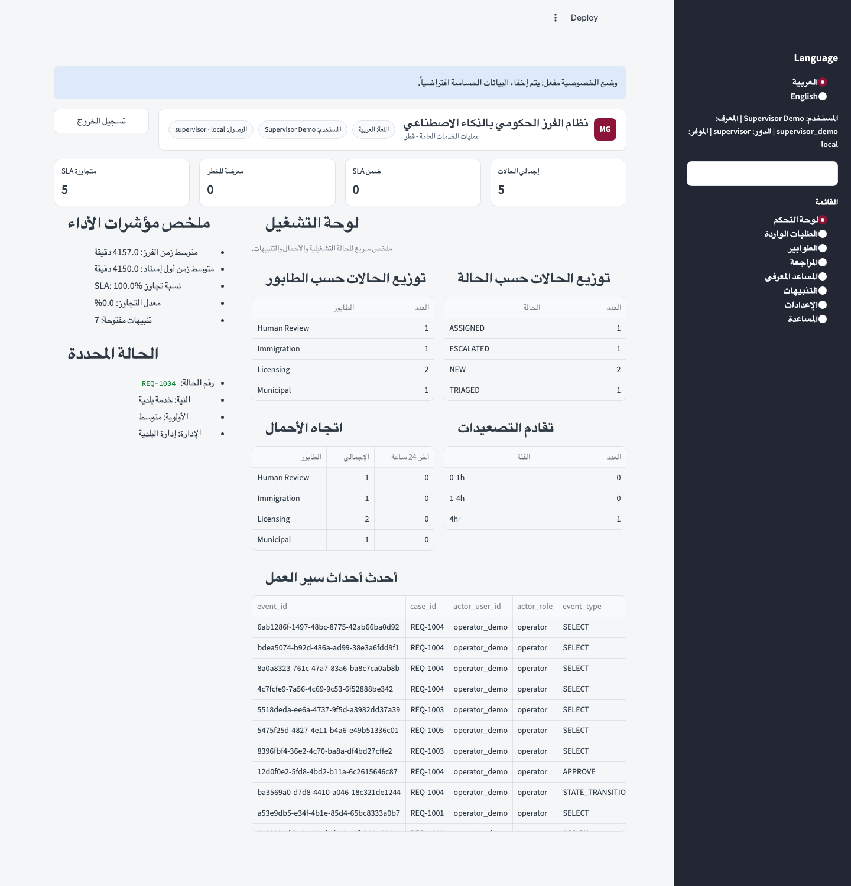
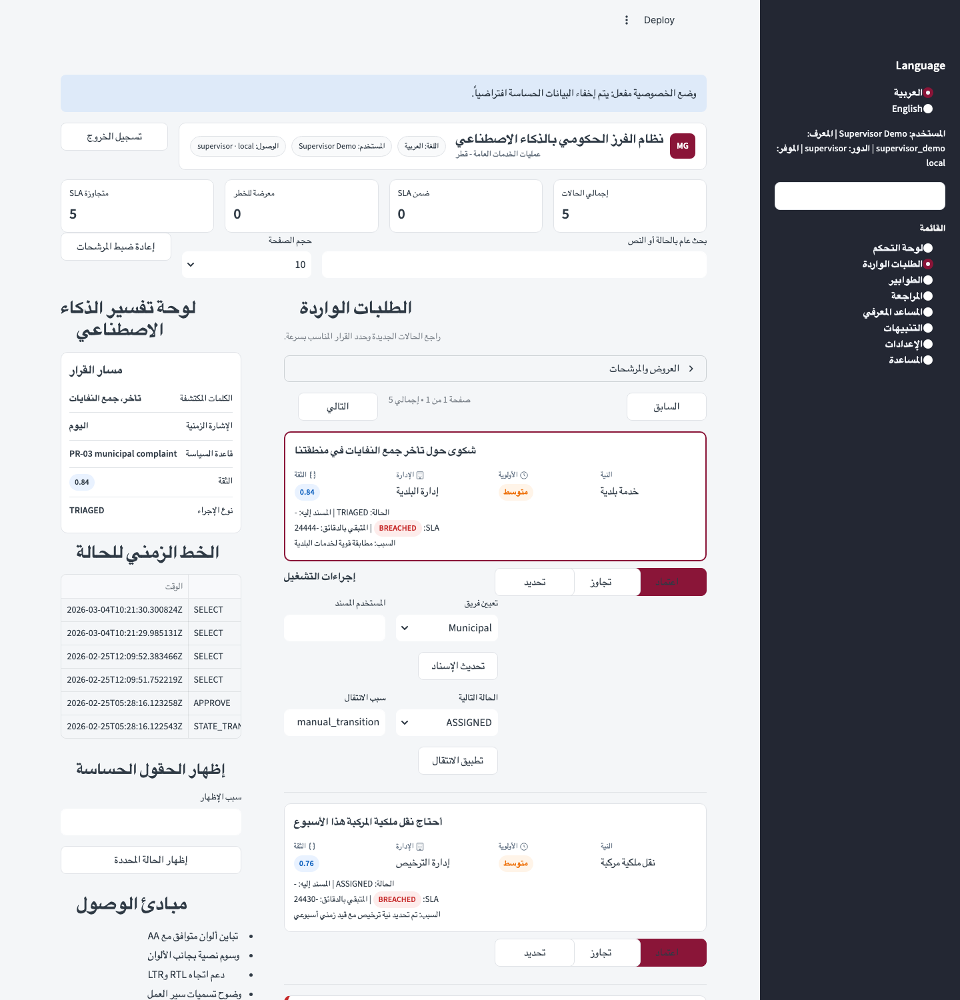
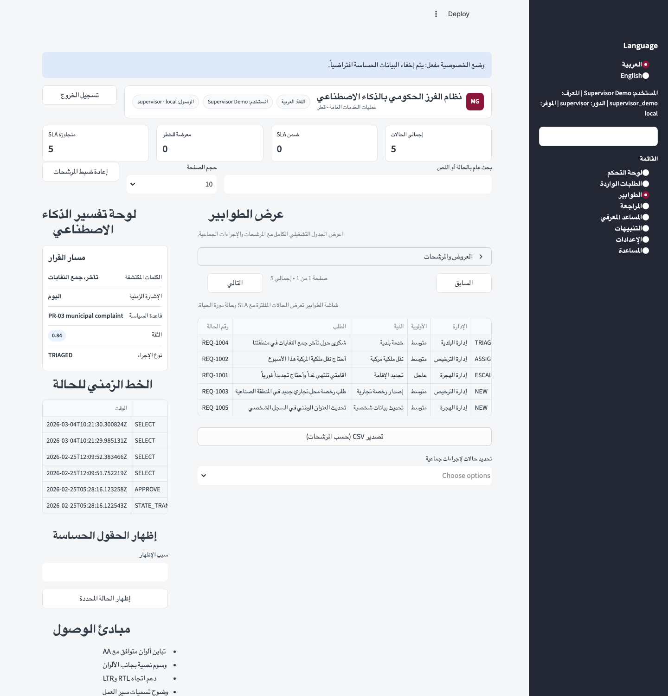
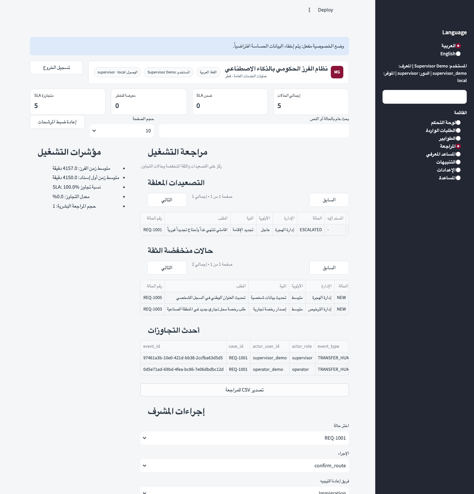
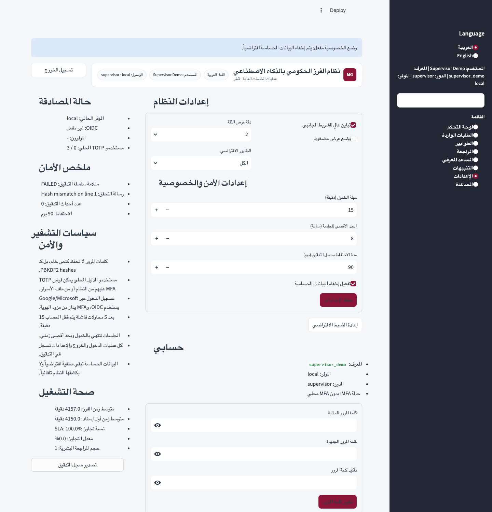
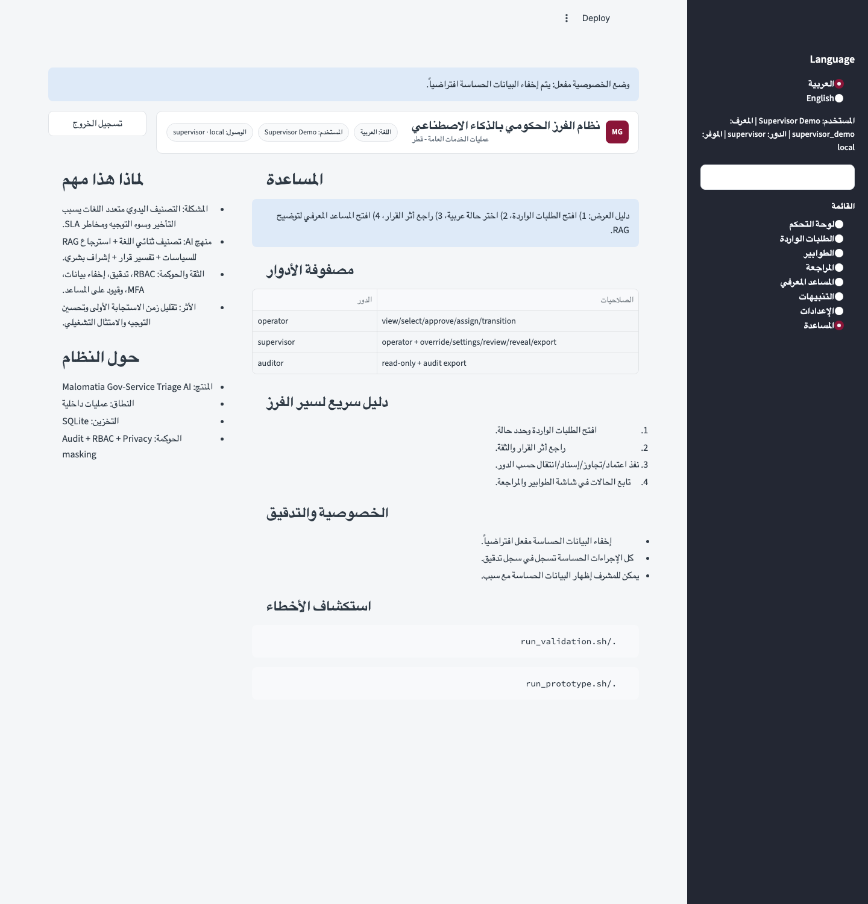
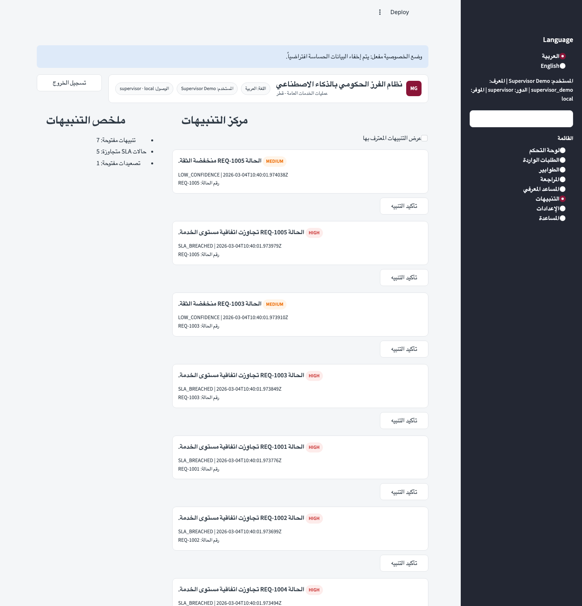
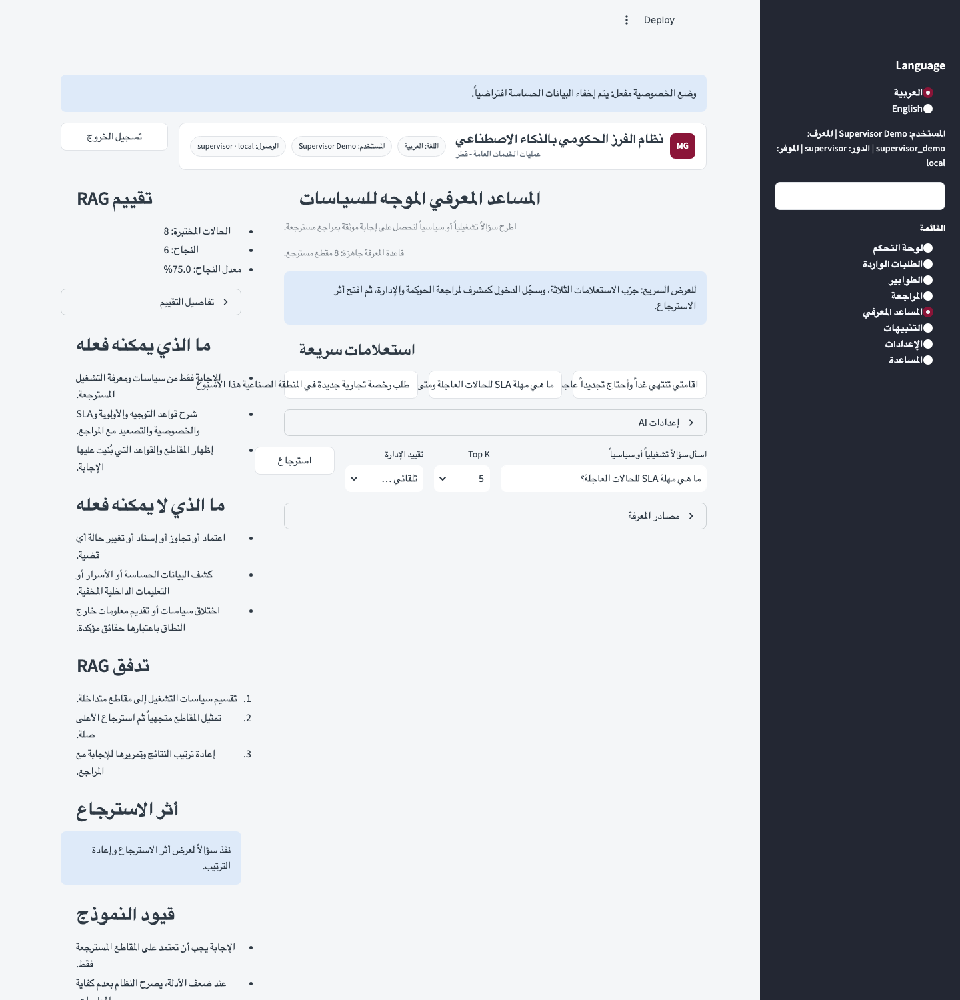

# Pilot Evidence Pack

## Validation Output

Command:

```bash
./run_validation.sh
```

Observed output:

```text
Running smoke validation...
PASS: smoke validation checks completed
Compiling FastAPI product path...
Running pytest suite...
...................................................                      [100%]
51 passed in 2.27s
Building Next.js webapp...
Next.js production build completed successfully
```

## Acceptance Checklist (Pass/Fail)

| Check | Status | Evidence |
|---|---|---|
| One-command local startup | PASS | `run_prototype.sh` |
| Auth gate active | PASS | Login UI gate before dashboard render |
| Session/action safety guard | PASS | `require_active_action(...)` guard usage in `gov_triage_dashboard.py` |
| Workflow/RBAC enforcement | PASS | `tests/test_workflow.py` |
| DB contention handled (controlled error) | PASS | lock test in `validation_smoke.py` and `tests/test_storage.py` |
| Schema migration idempotent and v7-safe | PASS | `tests/test_migrations.py` |
| Arabic default + clean single-language toggle | PASS | `ui_language_mode` default and toggle contract checks |
| Distinct nav pages (incl. Help/Notifications) | PASS | UI contract + rendered nav branches |
| Search/filter/pagination contracts present | PASS | smoke/UI contract checks + runtime controls |
| Saved views + notifications storage contract | PASS | storage tests for create/list/delete/ack |
| Account management and managed MFA active | PASS | `storage.py` user-admin functions + Settings UI + storage tests |
| Session 3 RAG retrieval pipeline active | PASS | `rag_engine.py` + `tests/test_rag_engine.py` + Assistant nav |
| Knowledge manifest and RAG benchmark evaluation active | PASS | `knowledge_manifest.json` + `rag_eval_set.json` + Assistant eval panel + validation smoke |
| Final release controls active | PASS | public sign-up policy + approval mode + release status + support inbox + export/backup controls in `gov_triage_dashboard.py` |
| Streamlit cloud packaging ready | PASS | `requirements.txt` + `DEPLOYMENT.md` + CI smoke workflow |

## Screenshot Contract

Store screenshots under:

- `docs/screenshots/`

Required filenames:

1. `dashboard-overview.png`
2. `incoming-requests.png`
3. `queues-view.png`
4. `review-page.png`
5. `settings-security.png`
6. `help-page.png`
7. `notifications-center.png`
8. `knowledge-assistant.png`

## Screenshot References

1. Dashboard


2. Incoming Requests


3. Queues


4. Review


5. Settings / Security


6. Help


7. Notifications


8. Knowledge Assistant


## Notes

- Scope is local and Streamlit Community demo readiness.
- Production controls (enterprise SSO/KMS/SIEM) remain out of this milestone.
- Auth state now includes provider-aware local/OIDC users plus managed local TOTP.
- RAG now exposes corpus manifest and an 8-question benchmark set with pass-rate summary.
- Final release defaults now disable public self-sign-up unless explicitly enabled by a supervisor.
- If public self-sign-up is enabled, approval mode can keep new accounts inactive until supervisor activation.
- Support feedback is now reviewable in-app and exportable via `feedback.log.jsonl`.
- Screenshot set is now present in the repo and was captured from a clean local authenticated supervisor session.
- The currently deployed Streamlit URL still redirects through Streamlit platform auth; public judge access still requires the app sharing setting to be switched to anyone with the link.
